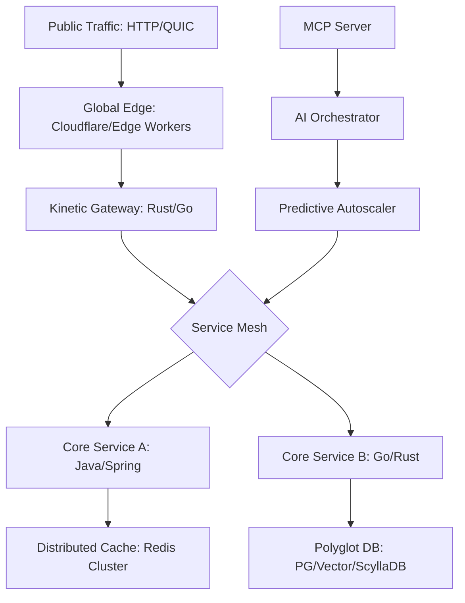

# ⚡ Project Kinetic Core: The High-Performance Backend Engine

**Project Kinetic Core** là trái tim của hệ thống hạ tầng Elite 2026. Đây là một High-Performance Backend Engine được thiết kế để xử lý tải cực lớn với độ trễ tối thiểu, tích hợp các công nghệ phân tán tiên tiến nhất và khả năng tự vận hành bằng AI.

---

## 🎯 Project Goals
1.  **Latency Superiority**: Đạt mục tiêu độ trễ P99 < 10ms cho các tác vụ chuẩn.
2.  **Autonomous Scaling**: Tích hợp AI để dự đoán và mở rộng tài nguyên tự động.
3.  **Cross-Protocol Unity**: Hỗ trợ liền mạch REST, gRPC, WebSocket và MCP.
4.  **Resilience by Architecture**: Không có điểm yếu duy nhất (No Single Point of Failure).

---

## 🏗️ System Architecture (Elite Standard)

---

## 🛠️ Tech Stack & Elite Tools
-   **Languages**: Java 21+ (Virtual Threads), Go (Concurrency), Rust (Performance).
-   **Observability**: OpenTelemetry, Prometheus, Grafana, Jaeger.
-   **Events**: Kafka (KRaft mode), NATS JetStream.
-   **Kubernetes**: GitOps with ArgoCD/Flux.
-   **AI Integration**: Model Context Protocol (MCP) for agentic interaction.

---

## 🚀 Phase-by-Phase Execution

| Phase | Milestone | Key Deliverables |
| :--- | :--- | :--- |
| **01** | **Base Infrastructure** | Thiết lập môi trường Cluster, Service Mesh và CI/CD. |
| **02** | **Core Engine** | Xây dựng logic xử lý đa giao thức và cơ chế lưu trữ phân tán. |
| **03** | **Event Hub** | Triển khai hệ thống hướng sự kiện với Kafka/NATS. |
| **04** | **AI Observability** | Tích hợp AI để phân tích log/trace và dự báo lỗi. |
| **05** | **Autonomic Scale** | Hoàn thiện cơ chế tự động mở rộng và tự chữa lành. |

---

## 🔒 Security & Reliability
-   **Security**: Đạt chuẩn FAPI (Financial-grade API), tích hợp mTLS.
-   **Reliability**: Đạt 99.999% Availability thông qua kiến trúc Multi-AZ.
-   **Compliance**: Sẵn sàng cho GDPR, CCPA bằng cơ chế mã hóa dữ liệu đầu-cuối.

---

## 🎓 Author
**Antigravity AI (Elite Skills Repository 2026)**
-   **Mastery Level**: Distinguished Architect Candidate.
-   **Field**: Backend Engineering & Distributed Systems.
