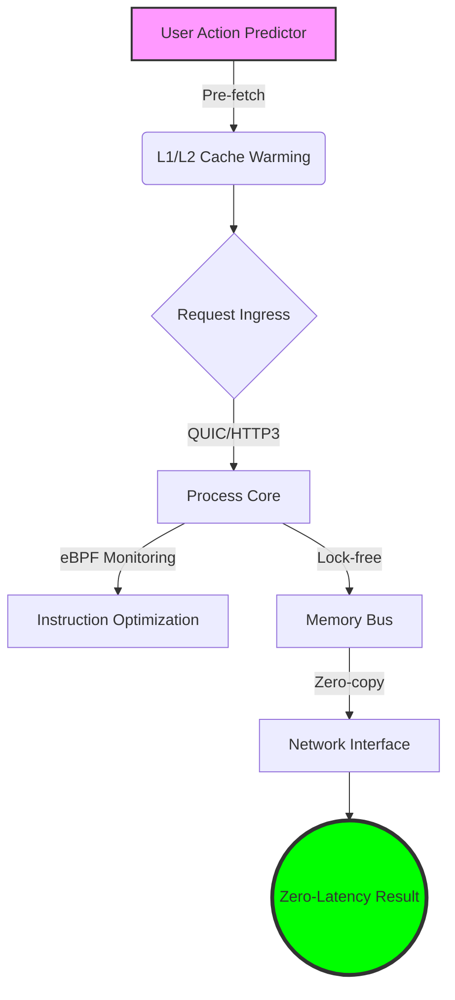

# 🚀 Backend Performance (Tối ưu hiệu năng Backend) — Elite Engineering Guide

## 🎯 Tiêu chuẩn Zero-Latency 2026 (Elite Vision)
Trong năm 2026, hiệu năng không còn là một "tính năng" (feature) mà là một "điều kiện tiên quyết" (prerequisite). Mục tiêu của Elite Engineering là đạt được **Zero-Perceived Latency** thông qua việc tối ưu hóa tầng sâu (Deep-stack optimization), từ mã máy (Assembly/Machine code) đến các node biên (Edge nodes). Chúng ta sử dụng AI để dự đoán tải và "warm-up" tài nguyên trước cả khi người dùng thực hiện hành động.

---

## 👨‍🏫 Elite Mentor (Cố Vấn Elite)

> [!TIP]
> **Vietnam perspective (🇻🇳):** Ở Việt Nam, tối ưu hiệu năng thường bị bỏ qua cho đến khi hệ thống "sập". Kỹ sư Elite phải đảo ngược quy trình này: **Performance-First**. Hãy học cách đọc `EXPLAIN ANALYZE` như đọc báo và hiểu rằng 1ms tiết kiệm được ở quy mô triệu người dùng là hàng nghìn USD chi phí Cloud.
> 
> **Global perspective (🇺🇸):** Globally, we are shifting towards **Carbon-aware Engineering**. Performance is now linked to sustainability. Elite engineers focus on **Instruction-level efficiency** and **eBPF-based observability** to squeeze every drop of power from the hardware. If your backend isn't profiling in real-time, you're flying blind.

---

## 🏗️ Lộ trình Elite 8 Giai đoạn (Performance Roadmap)

| # | Phase | Trọng Tâm (Focus Area) | Công cụ/Kỹ thuật Elite |
|---|-------|-------------------------|-------------------------|
| 1 | **Profiling** | Deep-stack Profiling | pprof, Pyroscope, eBPF (bpftrace). |
| 2 | **Database** | Execution Plan Optimization | Sharding, Materialized Views, Query Tuning. |
| 3 | **Networking** | Protocol Acceleration | QUIC, HTTP/3, gRPC compression, mTLS offloading. |
| 4 | **Caching** | Multi-tier Caching | Nginx/Varnish, Redis Modules, Client-side cache. |
| 5 | **Asynchronous** | Non-blocking Workflows | Zero-copy, Virtual Threads (Project Loom), Actors. |
| 6 | **Compute** | Logic Optimization | SIMD, GPU acceleration for specialized tasks. |
| 7 | **Scaling** | Predictive Auto-scaling | AI-driven load prediction, Warm-start strategies. |
| 8 | **Chaos** | Resilience & Performance | Chaos Engineering (Litmus), Latency Injection. |

---

## 🗺️ Elite Performance Map (Bản đồ Tối ưu)

> [!NOTE]
> **Technical References:**
> - 
> - 

---

## ⚡ Elite Lab Project: [TurboStream Engine]
👉 **[The TurboStream Engine](./projects/turbostream-engine/README.md)**: Xây dựng một engine xử lý dữ liệu thời gian thực với độ trễ cực thấp, sử dụng Rust/eBPF để tối ưu hóa throughput.

---

## 💡 Elite Best Practices
👉 **[Elite Performance Guide 2026](./references/best-practices-2026.md)**: Tổng hợp các kỹ thuật tối ưu hóa phần cứng, AI-native scaling và eBPF observability.

---

## 🧰 Quick Reference (Performance Pillars)
- **Avoid Premature Optimization**: Nhưng hãy thiết kế để **Dễ dàng tối ưu hóa** (Design for observability).
- **The 99th Percentile**: Đừng chỉ nhìn vào "Average Latency"; hãy tối ưu hóa cho P99 và P99.9 để đảm bảo trải nghiệm đồng nhất.
- **Data Locality**: Dữ liệu càng gần CPU, hệ thống càng nhanh. Tối ưu hóa Cache L1/L2/L3 và RAM access patterns.

---

## 🔗 Cross-Skill Navigation
- [Backend Developer](../Backend%20Developer%28Nh%C3%A0%20ph%C3%A1t%20tri%E1%BB%83n%20Backend%29/SKILL.md)
- [System Design](../System%20Design%28L%E1%BB%99%20tr%C3%ACnh%20Thi%E1%BA%BFt%20k%E1%BA%BF%20H%E1%BB%87% th%E1%BB%91ng%20Quy%20m%C3%B4%20L%E1%BB%9Bn%29/SKILL.md)
- [Cloud Infrastructure](../DevOps%28K%E1%BB%B9%20s%C6%B0%20DevOps%20&%20SRE%29/SKILL.md)

---
*Cập nhật lần cuối: Tháng 4, 2026 bởi Elite Performance Group*
