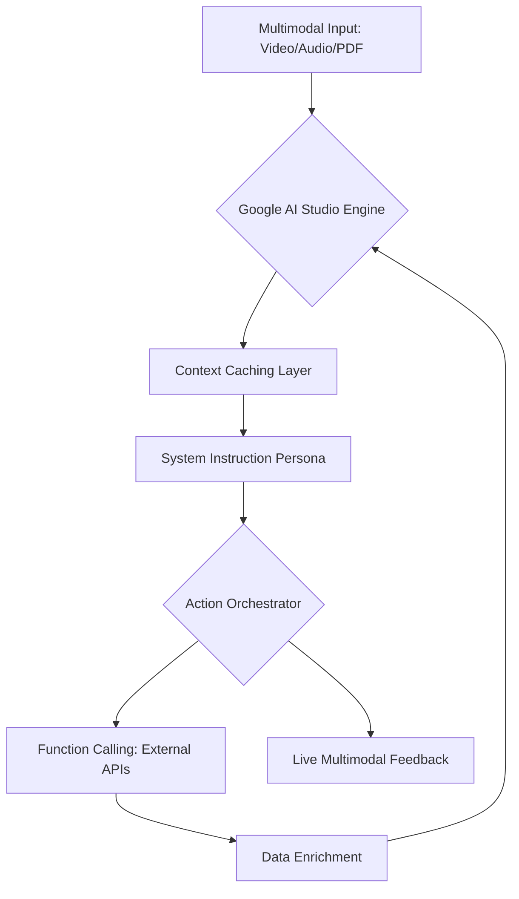

# 🌌 Project Gemini-X: The Autonomous Multimodal Agent System

**Project Gemini-X** là dự án Flagship trong lộ trình **Google AI Studio Mastery 2026**. Mục tiêu là xây dựng một hệ thống Agent đa phương thức có khả năng tự vận hành, tương tác với thế giới thực qua Video/Audio và xử lý khối lượng dữ liệu khổng lồ bằng Context Caching.

---

## 🎯 Project Goals
1.  **AI Orchestration**: Xây dựng logic điều phối để AI tự chọn công cụ (Function Calling).
2.  **Context Mastery**: Tận dụng 1M+ tokens context window để phân tích toàn bộ dự án hoặc thư viện tài liệu.
3.  **Real-time Multimodal**: Áp dụng Gemini 2.0 Live để tạo ra các trải nghiệm tương tác không độ trễ.
4.  **Autonomous Operations**: AI có khả năng tự sửa lỗi và tối ưu hóa hệ thống dựa trên phản hồi từ môi trường.

---

## 🏗️ System Architecture (Elite Standard)

---

## 🛠️ Tech Stack & Elite Tools
-   **Model**: Gemini 2 Pro / Flash (Latest Experimental).
-   **Context**: 1M+ Tokens with Prompt Caching.
-   **Capabilities**: Function Calling, Image/Video Vision, Google Search Grounding.
-   **Frameworks**: Google AI SDK for JavaScript/Python (Exported from Studio).

---

## 🚀 Phase-by-Phase Execution

| Phase | Milestone | Key Deliverables |
| :--- | :--- | :--- |
| **01** | **Studio Blueprint** | Thiết lập Structured Prompts và Domain-specific instructions. |
| **02** | **Tooling Hub** | Định nghĩa hệ thống Functions (JSON Schema) cho Agent. |
| **03** | **Memory Optimization** | Cấu hình Context Caching cho bộ tài liệu 10,000+ trang. |
| **04** | **Live Interaction** | Triển khai Gemini 2.0 Live cho tương tác hình ảnh/giọng nói. |
| **05** | **Agentic Deployment** | Đóng gói và triển khai hệ thống Agent lên môi trường Production. |

---

## 🔒 Safety & Standards
-   **Red Teaming**: Kiềm tra các lỗ hổng Prompt Injection ngay trong Studio.
-   **Harm Prevention**: Cấu hình bộ lọc an toàn để đảm bảo đầu ra chuẩn mực.
-   **Data Sovereignty**: Quản lý dữ liệu người dùng tuân thủ các quy định bảo mật mới nhất.

---

## 🎓 Author
**Antigravity AI (Elite Skills Repository 2026)**
-   **Mastery Level**: Platinum Certification Candidate.
-   **Field**: Multimodal Engineering & AI Innovation.
