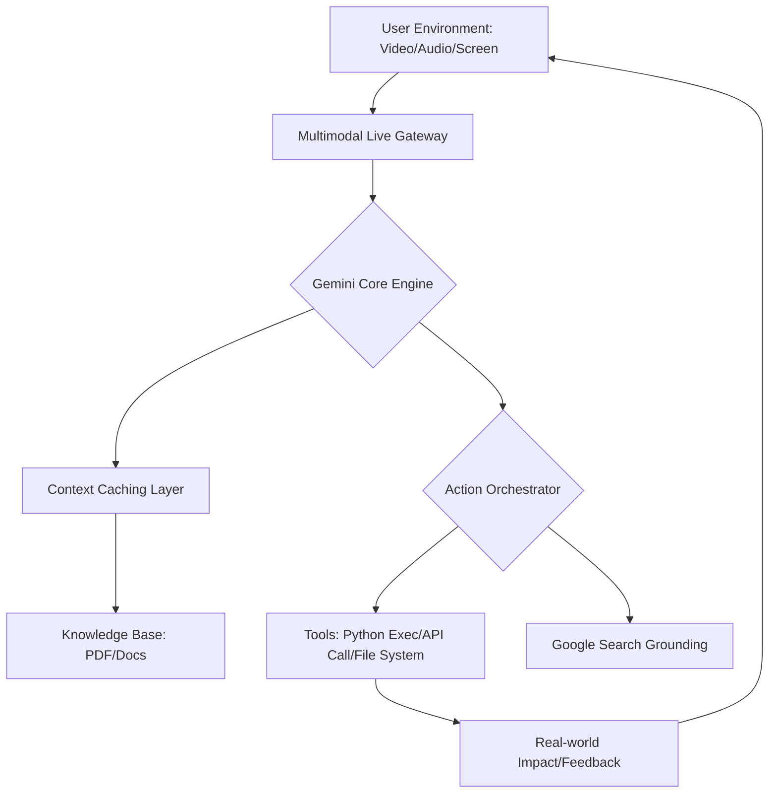

# 🌌 Project Nebula: The Autonomous Multimodal Assistant

**Project Nebula** là dự án Flagship trong lộ trình làm chủ **Google Gemini Ecosystem 2026**. Mục tiêu là xây dựng một trợ lý AI có khả năng cảm nhận đa phương thức (Multimodal) và hành động tự trị (Agentic) để hỗ trợ công việc chuyên sâu của con người.

---

## 🎯 Project Goals
1.  **Multimodal Perception**: Sử dụng camera và microphone để AI thấu hiểu ngữ cảnh xung quanh người dùng theo thời gian thực.
2.  **Agentic Execution**: Sử dụng Function Calling để AI có thể điều khiển ứng dụng, gửi email, hoặc truy vấn cơ sở dữ liệu.
3.  **Context Sovereignty**: Tận dụng Context Caching để AI luôn ghi nhớ lịch sử tương tác dài hạn mà không tốn chi phí lớn.
4.  **Zero-Latency Interaction**: Áp dụng Gemini 2.0 Live API để phản hồi gần như tức thì.

---

## 🏗️ System Architecture (Elite Standard)

---

## 🛠️ Tech Stack & Elite Tools
-   **Model**: Gemini 3.1 Flash (Primary) / Pro (Reasoning).
-   **SDK**: Unified `google-genai` (2026 Standard).
-   **Infrastructure**: Vertex AI / AI Studio for development.
-   **Communication**: WebSockets for Real-time Multimodal streaming.
-   **Observability**: Integrated Monitoring for Token Usage & Latency.

---

## 🚀 Phase-by-Phase Execution

| Phase | Milestone | Key Deliverables |
| :--- | :--- | :--- |
| **01** | **Unified Setup** | Cấu hình Client mới, xác thực và thiết lập Safety Filters. |
| **02** | **Vision & Audio In** | Triển khai cơ chế stream dữ liệu camera và voice lên Gemini. |
| **03** | **Knowledge Injection** | Nạp 1GB+ tài liệu vào Context Caching cho AI "học". |
| **04** | **Tooling Hub** | Xây dựng bộ Functions để AI tương tác với hệ thống. |
| **05** | **Live Deployment** | Hoàn thiện giao diện trò chuyện giọng nói/hình ảnh không độ trễ. |

---

## 🔒 Safety & Ethics
-   **Privacy-First**: Dữ liệu voice/video được mã hóa và xóa ngay sau khi xử lý.
-   **Human-in-the-loop**: Mọi hành động nhạy cảm đều cần xác nhận từ người dùng.
-   **Red Teaming**: Test khả năng chống lại các kịch bản thao túng AI.

---

## 🎓 Author
**Antigravity AI (Elite Skills Repository 2026)**
-   **Mastery Level**: Principal AI Architect Candidate.
-   **Field**: Multimodal Engineering & Ecosystem Design.
