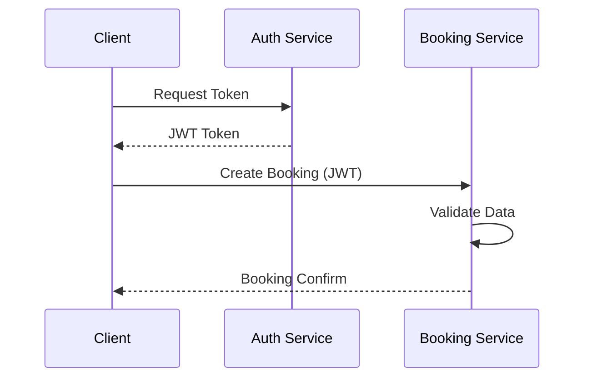

# Mastery Chapter: Behavioral & Interaction Modeling (2026)

Static diagrams show what the system *is*. Behavioral diagrams show what the system *does*.

## 1. Use Case Analysis

Use cases define the boundary and stakeholders of the system.

- **Actor**: External entities interacting with the system (Human, Machine, Service).
- **Use Case**: A sequence of actions providing value to the actor.
- **Include**: Mandatory sub-flows.
- **Extend**: Optional or conditional flows.

---

## 2. Sequence Diagrams (The Interactions)

In 2026, sequence diagrams are vital for documenting **Async Communication** and **API Orchestration**.

- **Focus**: Object/Service lifelines and the sequence of messages between them.
- **Synchronous**: Solid line with solid arrowhead (Wait for response).
- **Asynchronous**: Solid line with open arrowhead (No waiting).

---

## 3. State Machine Diagrams

Essential for complex entities with lifecycles (e.g., Orders, Payments, Insurance Claims).

- **State**: The condition of an object.
- **Transition**: The trigger that moves an object from State A to State B.
- **Guard**: A condition that must be met for the transition to occur.

---

## 🎭 Modeling Checklist
- [ ] Are my Actor names clear (e.g., `FinanceManager` vs `User`)?
- [ ] In Sequence Diagrams, am I showing the "Happy Path" OR the "Error Handling"? (Don't mix too much).
- [ ] Does every State in my State Machine have an Exit condition?
- [ ] Is the "System Boundary" clearly defined?

---
*Return to [SKILL.md](file:///e:/Google%20Antigravity/Skills/System%20Analysis%28Ph%C3%A2n%20t%C3%ADch%20Thi%E1%BA%BFt%20k%E1%BA%BF%20HTTT%29/SKILL.md)*
