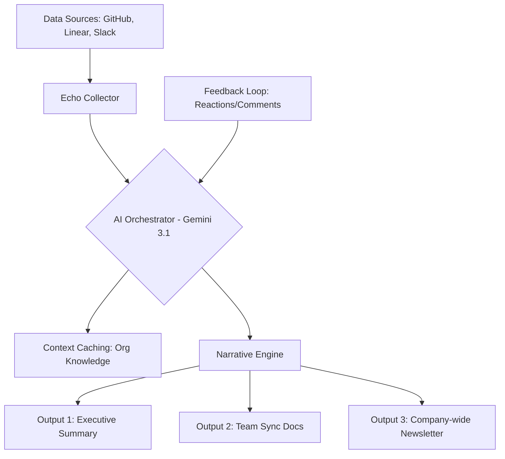

# 🌀 Project Echo: The Autonomous Organizational Nervous System

**Project Echo** là dự án Flagship trong lộ trình **Internal Communications Mastery 2026**. Mục tiêu là xây dựng một hệ điều phối thông tin tự động, xóa bỏ khoảng cách giữa "Code" và "Communication", giúp toàn bộ tổ chức luôn đồng bộ mà không tốn công sức thủ công.

---

## 🎯 Project Goals
1.  **Zero-Manual Updates**: Tự động hóa việc tạo báo cáo 3P (Progress, Plans, Problems) từ hoạt động thực tế trên Git và Project Management tools.
2.  **High-Signal Intelligence**: Sử dụng AI để lọc nhiễu, chỉ gửi những thông tin quan trọng nhất đến đúng đối tượng.
3.  **Cultural Synchronization**: Đảm bảo mọi thành viên hiểu rõ mục tiêu chung (Mission & OKRs) thông qua dòng chảy thông tin nhất quán.
4.  **Insightful Retrospectives**: Tự động tổng hợp dữ liệu sau mỗi Sprint để highlight những điểm nghẽn và thành tựu.

---

## 🏗️ System Architecture (Elite Standard)

---

## 🛠️ Tech Stack & Elite Tools
-   **Engine**: Google Gemini 2.0/3.1 via `google-genai` SDK.
-   **Integrations**: GitHub Webhooks, Linear API, Slack Bolt SDK.
-   **Infrastructure**: Serverless functions (Cloud Functions/Vercel) for real-time processing.
-   **Automation**: GitHub Actions for scheduled summaries.

---

## 🚀 Phase-by-Phase Execution

| Phase | Milestone | Key Deliverables |
| :--- | :--- | :--- |
| **01** | **Data Ingestion** | Kết nối API và thu thập dữ liệu thô từ Git/Linear. |
| **02** | **Signal Filtering** | Huấn luyện AI phân biệt giữa "Task nhỏ" và "Milestone quan trọng". |
| **03** | **Narrative Gen** | Xây dựng các templates báo cáo 3P và Newsletter tự động. |
| **04** | **Feedback Integration** | Cho phép con người chỉnh sửa và phản hồi trực tiếp vào báo cáo của AI. |
| **05** | **Org-wide Rollout** | Triển khai Echo làm kênh truyền thông chính thức cho toàn đơn vị. |

---

## 🔒 Accuracy & Trust
-   **Verified Facts**: AI luôn phải đính kèm link dẫn đến task/commit thực tế để kiểm chứng.
-   **Privacy Guard**: Tự động ẩn các thông tin nhạy cảm (secrets, credentials) khỏi báo cáo nội bộ.
-   **Human Review**: Chế độ "Draft" cho phép lãnh đạo duyệt trước khi phát hành rộng rãi.

---

## 🎓 Author
**Antigravity AI (Elite Skills Repository 2026)**
-   **Mastery Level**: Organizational Architect Candidate.
-   **Field**: Internal Communications & Engineering Culture.
